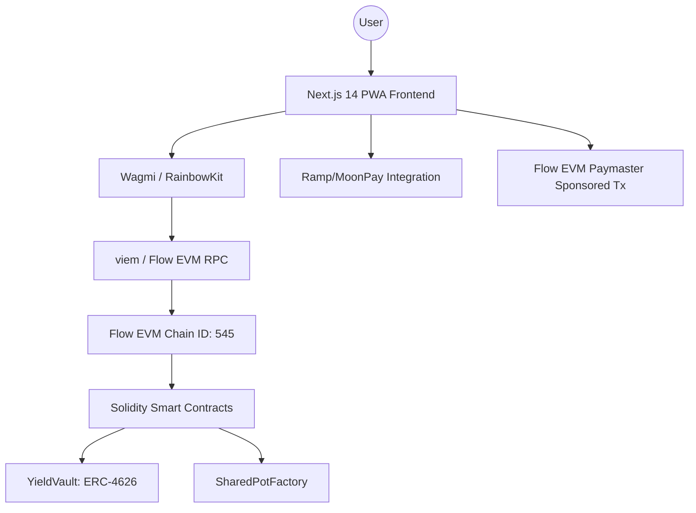

# Farsi Project Architecture & Structure

## 1. High-Level Architecture Diagram



**Technical Logic:**
- **PWA Frontend**: Built with Next.js 14 for speed, SEO, and native-like installation.
- **Wagmi/viem**: Handles wallet connections and contract interactions on Flow EVM.
- **Flow EVM RPC**: Connects to `https://testnet.evm.nodes.onflow.org`.
- **Sponsored Transactions**: Utilizes Flow's gas abstraction features (stubbed for demo).

## 2. Project Folder Structure

```text
farsi/
├── app/                    # Next.js App Router
│   ├── layout.tsx          # Root layout with Web3 providers
│   ├── page.tsx            # Main Dashboard
│   ├── buy/                # Buy screen route
│   ├── earn/               # Earn screen route
│   ├── social/             # Social/Pots screen route
│   └── globals.css         # Strict theme styling
├── components/             # Reusable UI components
│   ├── Navigation.tsx      # Bottom tab bar
│   ├── screens/            # Feature-specific screen components
│   └── ui/                 # Flat, minimal UI elements
├── contracts/              # Solidity source code
│   ├── YieldVault.sol      # ERC-4626 Vault
│   └── SharedPotFactory.sol # Factory for social pots
├── lib/                    # Logic and constants
│   ├── web3-config.ts      # Wagmi/RainbowKit configuration
│   └── integrations.ts     # Ramp/MoonPay snippets
├── public/                 # Static assets
│   └── manifest.json       # PWA Manifest
├── styles/                 # Theme tokens (if needed)
├── next.config.js          # PWA plugin configuration
├── package.json            # Dependencies
├── README.md               # User guide
└── ARCHITECTURE.md         # This document
```
