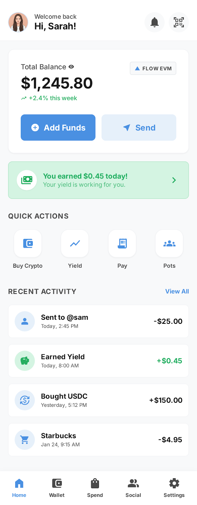
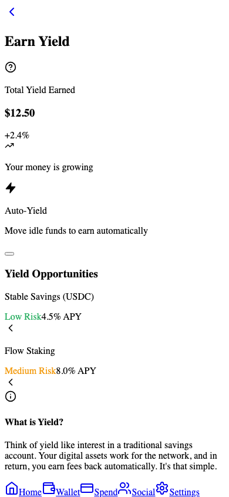
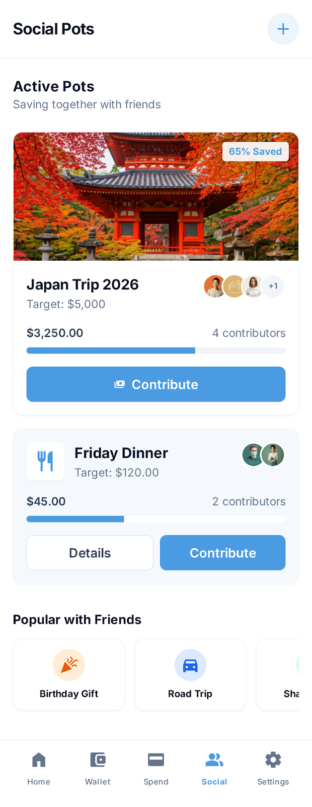
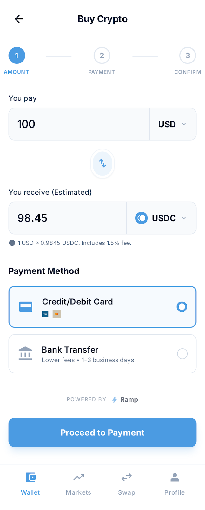
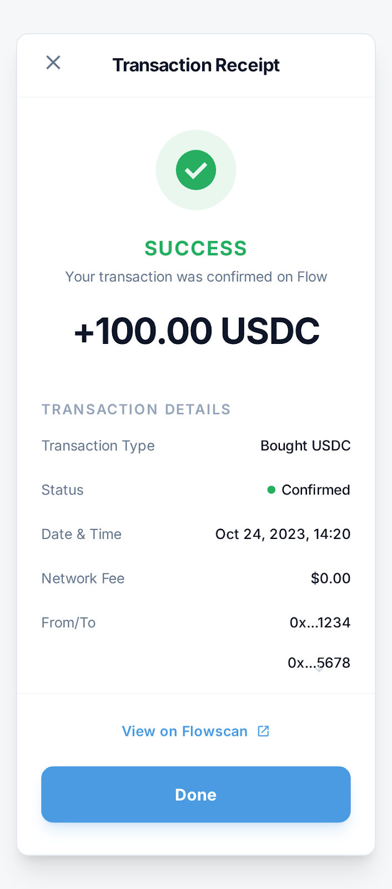
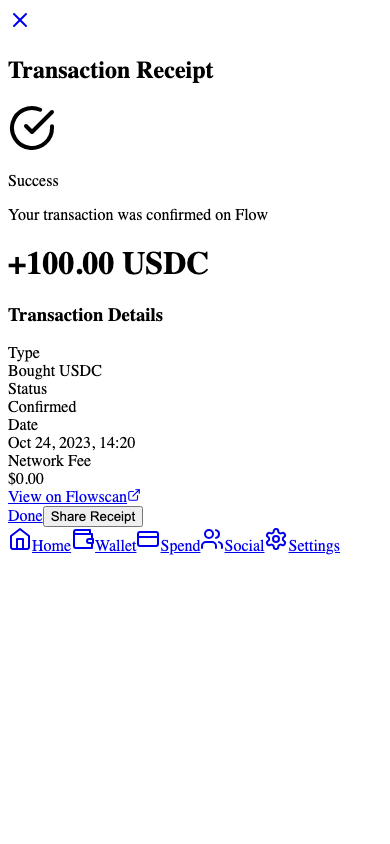

#  Farsi: Finance, but for Humans

**The money app that makes sense.**  
Farsi is a mobile-first wallet built on [Flow EVM](https://flow.com/evm) that takes the technical headache out of DeFi. We’ve stripped away the jargon and the complexity to give you a premium finance experience that feels just as natural as your favorite banking app—only smarter.

Whether you're looking to earn yield on your savings or pool money with your friends for a weekend trip, Farsi handles the heavy lifting on-chain so you can focus on your goals.

---

## 💡 Why Farsi?

Money is social, but crypto hasn't been. Most DeFi apps feel like they were built for robots—filled with gas fees, seed phrases, and complicated charts. Farsi changes that.

We believe your money should work for *you*, and it should be easy to manage with the people you care about. By building on **Flow**, we’ve created an experience where "gas" isn't a word you'll need to know, and "security" is a given. It’s the stability of the blockchain with the simplicity of a flick of your thumb.

---

## 📸 Snapshot of the Experience

| | | |
|:---:|:---:|:---:|
|  |  |  |
| **Your Home Base** | **Grow Your Wealth** | **Save with Friends** |
|  |  |  |
| **Get Started Fast** | **Track Every Penny** | **Celebrate Progress** |

---

## ✨ What counts?

### 💰 **Farsi Earn: Set it and Forget it**
Don't let your money sit idle. Slip your `mUSDC` into our Earn vault and watch it grow. It uses the industry-standard ERC-4626 vault protocol, so you get the best security and instant access to your funds whenever you need them. No lock-ups, no catch.

### 🤝 **Social Pots: Bigger Goals, Together**
Saving for a group gift? Planning the ultimate road trip? Social Pots let you and your friends pool funds together in a transparent, on-chain way. 
- **Stay on Track**: Set a goal and see exactly how close the group is to hitting it.
- **Creator Rules**: Only the pot creator can pull the trigger on a withdrawal once the target is reached, keeping things organized and safe.

### ⛽ **Magic Behind the Scenes**
- **No More "Gas"**: Thanks to Flow EVM's sponsored transactions, the fees are on us. You just click and go.
- **Always With You**: Farsi is a Progressive Web App (PWA). Just "Add to Home Screen" and it's there whenever you need it, even if your connection is spotty.
- **Log in your way**: No complicated setup. Use your social logins through Privy and you're in.

---

## 🛠 What's under the hood?

We use the best tech in the game to keep things fast, secure, and beautiful.
- **Frontend**: Next.js 14 & Tailwind CSS (for that premium feel).
- **Web3 Tools**: Wagmi & RainbowKit (making wallet connections a breeze).
- **Smart Contracts**: Solidity (Standard-setting ERC-20 & ERC-4626).
- **Network**: Flow EVM Testnet (Chain ID: 545).

---

## 📍 Where we're live (Testnet)

| Asset / Contract | Address |
| :--- | :--- |
| **Mock mUSDC** | `0x63F28bF688e38429E4123503cdba1A9237aAe8B9` |
| **Yield Vault** | `0x8DF0868e0f0c00C73e2315C74D6CFaD42Db4bBD2` |
| **SharedPotFactory** | `0x77326e1532e97f9022D15a5D1d186e196c853abC` |

---

## 🚀 Jump In

### 1. Set it up
```bash
git clone https://github.com/AltcoinDaddy/farsi.git
cd farsi
npm install
```

### 2. Configure
Toss your keys into a `.env.local` file:
```env
NEXT_PUBLIC_WC_PROJECT_ID=your_rainbowkit_project_id
NEXT_PUBLIC_FLOW_RPC=https://testnet.evm.nodes.onflow.org
PRIVATE_KEY=your_private_key
```

### 3. Go Live
```bash
npm run dev
```

---

## 🏁 How to Demo
If you're checking us out for the **PL Genesis Hackathon**:
1.  **Get funded**: Head to the **Earn** screen and tap the "Get 1000" button for your test funds.
2.  **Grow it**: Deposit some of that into the vault.
3.  **Start a movement**: Create a Social Pot and see how easy it is to save with the group.

---
